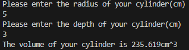

# Cylinder Volume Calculator

<details>
  <summary style="font-Size: 16pt">Code:</summary>
```python
iRadius = float(input("Please enter the radius of your cylinder(cm)\n"))
iDepth = float(input("Please enter the depth of your cylinder(cm)\n"))

print(f"The volume of your cylinder is {round((3.14159*iRadius**2)*iDepth, 3)}cm^3")
```
</details>
### Output:


## [Return to portfolio here.](README.md)
