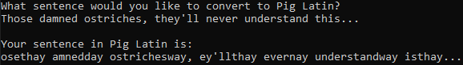

# Pig Latin encryptor

This program takes a sentence from the user, breaks it down into each word, converts each word into [Pig Latin](https://web.ics.purdue.edu/~morelanj/RAO/prepare2.html) and prints them.

## Code:
```python
##func

def pigCalc():
    if (userText[0].lower() in vowels) == True: #Checks if the first letter is a vowel
        pigText = userText + "way"
        return pigText
    elif userText[0:2].lower() == "qu": #Checks if first two letters are "qu"
        pigText = userText[2:].lower() + userText[0:2].lower() + "ay"
        return pigText
    elif (userText[1].lower() in vowels) == False: #Checks if second letter is not a vowel
        pigText = userText[2:].lower() + userText[0:2].lower() + "ay"
        return pigText
    else:
        pigText = userText[1:] + userText[0].lower() + "ay"
        return pigText

##main

x = 0
userText = str(input("What sentence would you like to convert to Pig Latin?\n"))

vowels = ["a", "e", "i", "o", "u"] #Used to check for vowels in future statements

wordSplit = userText.split()
while x in range(len(wordSplit)):
    userText = wordSplit[x]
    print(f'"{userText}" in Pig Latin is: "{pigCalc()}"')
    x += 1
```

### Output:



## [Return to portfolio here.](README.md)