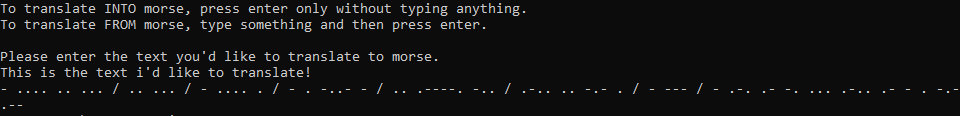
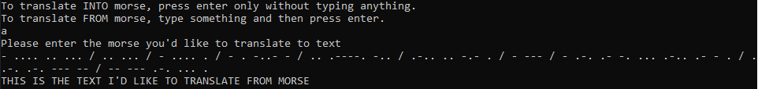

# Morse code translator
This program was a small test to show the strength of list comprehensions in python, allowing for a working morse code translator to be compressed into a single line. It seperates the user's input into either characters or chunks of morse, and then translates them through the respective dictionary. It relies on predefined dictionaries and has zero error handling, meaning crashes are easy to reach both intentionally and unintentionally, however the point of the program is novelty rather than efficiency, readability or any realistic use! :)

### [Code:](/morseCode.py/raw) 
```python
print(" ".join([{"A" : ".-", "B" : "-...", "C" : "-.-.", "D" : "-..", "E" : ".", "F" : "..-.", "G" : "--.", "H" : "....", "I" : "..", "J" : ".---", "K" : "-.-", "L" : ".-..", "M" : "--", "N" : "-.", "O" : "---", "P" : ".--.", "Q" : "--.-", "R" : ".-.", "S" : "...", "T" : "-", "U" : "..-", "V" : "...-", "W" : ".--", "X" : "-..-", "Y" : "-.--", "Z" : "--..", "1" : ".----", "2" : "..---", "3" : "...--", "4" : "....-", "5" : ".....", "6" : "-....", "7" : "--...", "8" : "---..", "9" : "----.", "0" : "-----", "," : "--..--", "." : ".-.-.-", "/" : "-..-.", ":" : "---...", "@" : ".--.-.", "\'" : ".----.", "\"" : ".-..-.", "!" : "-.-.--", "?" : "..--..", "&" : ".-...", "(" : "-.--.", ")" : "-.--.-", "-" : "-....-", "+" : ".-.-.", "=" : "-...-", " " : "/"}[char] for char in input("Please enter the text you'd like to translate to morse.\n").upper()])) if input("To translate INTO morse, press enter only without typing anything.\nTo translate FROM morse, type something and then press enter.\n") == "" else print("".join([{'.-': 'A', '-...': 'B', '-.-.': 'C', '-..': 'D', '.': 'E', '..-.': 'F', '--.': 'G', '....': 'H', '..': 'I', '.---': 'J', '-.-': 'K', '.-..': 'L', '--': 'M', '-.': 'N', '---': 'O', '.--.': 'P', '--.-': 'Q', '.-.': 'R', '...': 'S', '-': 'T', '..-': 'U', '...-': 'V', '.--': 'W', '-..-': 'X', '-.--': 'Y', '--..': 'Z', '.----': '1', '..---': '2', '...--': '3', '....-': '4', '.....': '5', '-....': '6', '--...': '7', '---..': '8', '----.': '9', '-----': '0', '--..--': ',', '.-.-.-': '.', '-..-.': '/', '---...': ':', '.--.-.': '@', '.----.': "'", '.-..-.': '"', '-.-.--': '!', '..--..': '?', '.-...': '&', '-.--.': '(', '-.--.-': ')', '-....-': '-', '.-.-.': '+', '-...-': '=', '/': ' '}[char] for char in input("Please enter the morse you'd like to translate to text\n").split(" ")]))
```

### Output:
Into morse:


From morse:


## [Return to portfolio here.](README.md)
